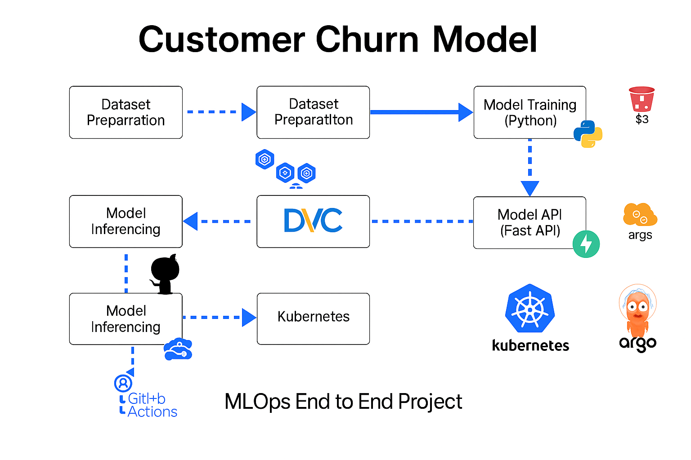
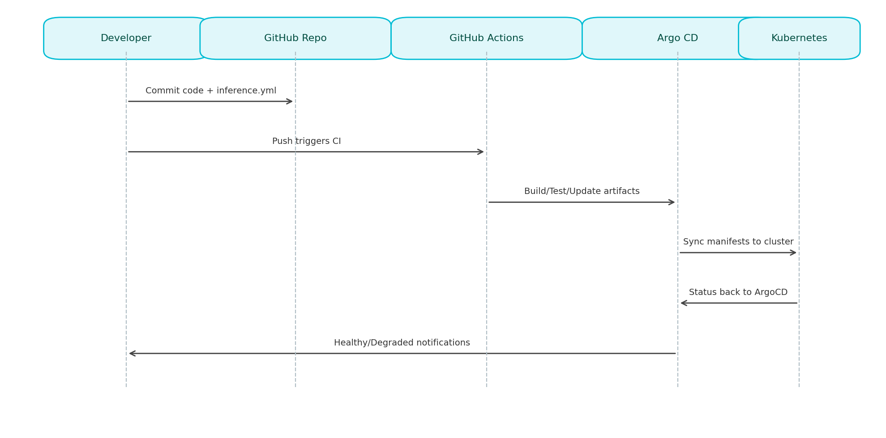
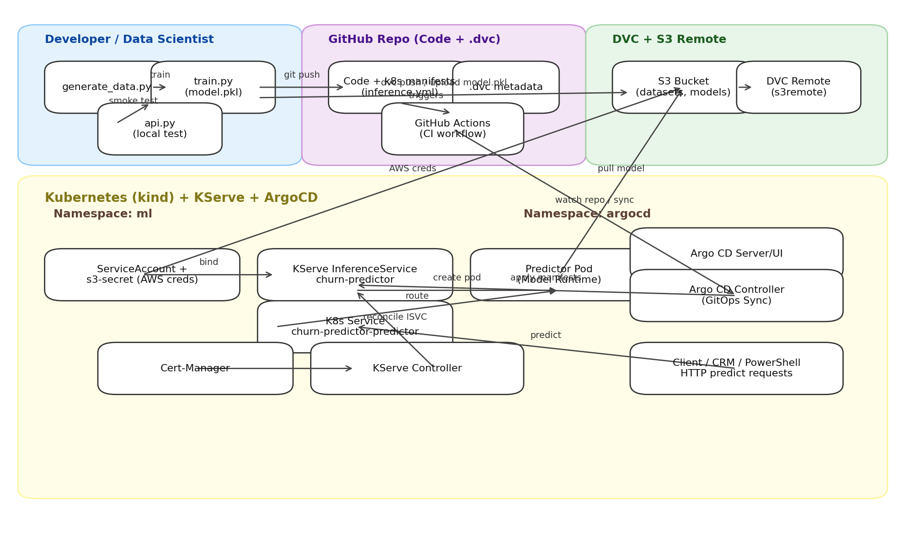
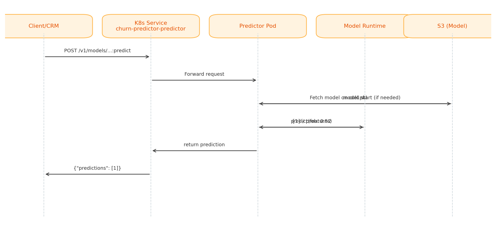

# 📊 Customer Churn Prediction — End‑to‑End MLOps (DVC · KServe · Kubernetes · GitHub Actions · ArgoCD)

_Real‑time telecom churn prediction with reproducible data, cloud model storage, production model serving, and GitOps CI/CD._



---

## 📚 Table of Contents
- [What Does This Model Do?](#-what-does-this-model-do)
- [Real‑World Example (Telecom Industry Scenario)](#-realworld-example-telecom-industry-scenario)
- [Prerequisites](#-prerequisites)
- [Getting Started (Local Dev)](#-getting-started-local-dev)
- [Data Versioning with DVC + S3](#-data-versioning-with-dvc--s3)
- [Create Kubernetes Cluster (Kind)](#-create-kubernetes-cluster-kind)
- [Install KServe (with Cert‑Manager)](#-install-kserve-with-certmanager)
- [Secure S3 Access (ServiceAccount + Secret)](#-secure-s3-access-serviceaccount--secret)
- [Deploy InferenceService & Test](#-deploy-inferenceservice--test)
- [Troubleshooting S3 Credentials](#-troubleshooting-s3-credentials)
- [CI/CD — GitHub Actions + ArgoCD](#-cicd--github-actions--argocd)
- [Architecture Diagrams](#-architecture-diagrams)

---

## 🔍 What Does This Model Do?
This repository delivers a **Customer Churn Prediction** system for the telecom industry. It predicts:

- **Will a customer churn?** (`0/1`)
- **What is the probability of churn?** (e.g., `0.52`)

The model runs **locally** (via `api.py`) for development and **in Kubernetes** via **KServe** for production. The stack ensures your workflow is **reproducible (DVC + S3)** and **continuously deployed (GitHub Actions + ArgoCD)**.

**Inputs (features)**: `age`, `tenure_months`, `monthly_charges`, `total_charges`, `num_support_calls`

**Outputs**: `churn` (0/1), `churn_probability` (0.0–1.0)

**Business impact**: early identification of at‑risk customers enables **retention offers**, **priority support**, and higher **lifetime value**.

---

## 🌍 Real‑World Example (Telecom Industry Scenario)
Imagine **TeleComX**, a telecom provider, wants to **reduce customer churn**. They use this project to **predict churn in real time** and **automate deployments** to production.

### 1) Data Science → Modeling & Local Validation
Create a venv, install deps, generate data, train, and run the local API:

```bash
python -m venv .venv
.venv\Scripts\activate
python -m pip install -r requirements.txt
python generate_data.py
python train.py
python api.py
```

**Local prediction example (PowerShell):**
```powershell
Invoke-RestMethod -Uri http://localhost:8000/predict `
  -Method POST `
  -Headers @{ "Content-Type" = "application/json" } `
  -Body '{
    "age": 45,
    "tenure_months": 24,
    "monthly_charges": 79.99,
    "total_charges": 1920.00,
    "num_support_calls": 3
  }'
```

**Response**
```
churn  churn_probability
-----  -----------------
1      0.52
```

### 2) Data Team → Versioning the Dataset in S3 (DVC)
```bash
python -m pip install dvc
python -m pip install dvc-s3

dvc init
# Configure AWS (interactive)
aws configure

# Add remote & push dataset
dvc remote add -d s3remote s3://aws-bedrock-blogs-bucket-220781
dvc add .\data\churn_data.csv
dvc push
```
> Also store your trained model artifact (e.g., `model.pkl`) in the same S3 bucket.

### 3) MLOps → Deploying with Kubernetes + KServe
Create a local Kubernetes cluster (Kind):
```bash
kind create cluster --name=churn-model-cluster
```
Install Cert‑Manager (required by KServe):
```bash
kubectl apply -f https://github.com/cert-manager/cert-manager/releases/latest/download/cert-manager.yaml
```
Install KServe CRDs (PowerShell):
```powershell
helm install kserve-crd oci://ghcr.io/kserve/charts/kserve-crd `
  --version v0.16.0 `
  -n kserve `
  --wait
```
Install KServe Controller (PowerShell):
```powershell
helm install kserve oci://ghcr.io/kserve/charts/kserve `
  --version v0.16.0 `
  -n kserve `
  --set kserve.controller.deploymentMode=RawDeployment `
  --wait
```

---

## 🧰 Prerequisites
- **Python 3.9+**, **pip**
- **PowerShell** (for Windows commands) or **bash**
- **Docker** & **kind** (Kubernetes in Docker)
- **kubectl**, **helm**
- **AWS CLI** configured (`aws configure`)
- **DVC** (`dvc`, `dvc-s3`)

---

## 🏁 Getting Started (Local Dev)
```bash
python -m venv .venv
.venv\Scripts\activate
python -m pip install -r requirements.txt
python generate_data.py
python train.py
python api.py
```

**Sample request (PowerShell):** see example above.

---

## 📦 Data Versioning with DVC + S3
```bash
python -m pip install dvc
python -m pip install dvc-s3

dvc init
aws configure

dvc remote add -d s3remote s3://aws-bedrock-blogs-bucket-220781
dvc add .\data\churn_data.csv
dvc push
```
**Typical DVC‑tracked files in `data/`:**
```
Mode                 LastWriteTime         Length Name
----                 -------------         ------ ----
-a----          2/1/2026   9:32 PM             17 .gitignore
-a----          2/1/2026   9:32 PM          51314 churn_data.csv
-a----          2/1/2026   9:32 PM            100 churn_data.csv.dvc
```

---

## ☸️ Create Kubernetes Cluster (Kind)
```bash
kind create cluster --name=churn-model-cluster
```

---

## 🧪 Install KServe (with Cert‑Manager)
Install **Cert‑Manager**:
```bash
kubectl apply -f https://github.com/cert-manager/cert-manager/releases/latest/download/cert-manager.yaml
```

Install **KServe CRDs**:
```powershell
helm install kserve-crd oci://ghcr.io/kserve/charts/kserve-crd `
  --version v0.16.0 `
  -n kserve `
  --wait
```
_Linux alternative:_
```bash
helm install kserve-crd oci://ghcr.io/kserve/charts/kserve-crd \
  --version v0.16.0 \
  -n kserve \
  --wait
```

Install **KServe Controller**:
```powershell
helm install kserve oci://ghcr.io/kserve/charts/kserve `
  --version v0.16.0 `
  -n kserve `
  --set kserve.controller.deploymentMode=RawDeployment `
  --wait
```
_Linux alternative:_
```bash
helm install kserve oci://ghcr.io/kserve/charts/kserve \
  --version v0.16.0 \
  -n kserve \
  --set kserve.controller.deploymentMode=RawDeployment \
  --wait
```

Check status:
```bash
kubectl get crds
kubectl get pods -n kserve
```

---

## 🔐 Secure S3 Access (ServiceAccount + Secret)
Because the S3 bucket is private, create a **ServiceAccount** in the `ml` namespace with an **AWS credentials secret**.

```bash
kubectl create namespace ml
kubectl apply -f .\k8s\serviceaccount.yml
kubectl get sa -n ml
```

Your **InferenceService** manifest (e.g., `.\k8s\inference.yml`) should reference that ServiceAccount.

Apply it:
```bash
kubectl apply -f .\k8s\inference.yml
kubectl get pods -n ml -w
kubectl get svc -n ml
```

---

## 🚀 Deploy InferenceService & Test
Port‑forward the KServe service:
```bash
kubectl port-forward svc/churn-predictor-predictor 7001:80 --address 0.0.0.0 -n ml
```
**Prediction (PowerShell):**
```powershell
Invoke-RestMethod -Method Post -Uri "http://localhost:7001/v1/models/churn-predictor:predict" `
  -ContentType "application/json" `
  -Body '{
    "instances": [
      [45, 24, 79.99, 1920.00, 3]
    ]
  }'
```
**Output**
```
predictions
-----------
{1}
```

---

## 🛠 Troubleshooting S3 Credentials
If the pod cannot access S3, recreate the secret and restart pods:

```bash
kubectl delete secret s3-secret -n ml
kubectl create secret generic s3-secret -n ml \
  --from-literal=AWS_ACCESS_KEY_ID=AKIAxxxxxxxxxxxx \
  --from-literal=AWS_SECRET_ACCESS_KEY=xxxxxxxxxxxxxxxxxxxxxxxxxxxxxxxx

kubectl get secret s3-secret -n ml -o yaml
kubectl delete pod -n ml -l serving.kserve.io/inferenceservice=churn-predictor
```

Re‑test on another forwarded port (example):
```bash
kubectl port-forward svc/churn-predictor-predictor 8115:80 --address 0.0.0.0 -n ml
Invoke-RestMethod -Method Post -Uri "http://localhost:8115/v1/models/churn-predictor:predict" `
  -ContentType "application/json" `
  -Body '{
    "instances": [
      [45, 24, 79.99, 1920.00, 3]
    ]
  }'
```

---

## 🔄 CI/CD — GitHub Actions + ArgoCD
Install **ArgoCD**:
```bash
kubectl create namespace argocd
kubectl apply -n argocd -f https://raw.githubusercontent.com/argoproj/argo-cd/stable/manifests/install.yaml
```
Access ArgoCD UI:
```bash
kubectl get svc -n argocd
kubectl port-forward svc/argocd-server 7003:80 --address 0.0.0.0 -n argocd
```
Get initial admin credentials:
```bash
kubectl get secrets -n argocd
kubectl edit secrets/argocd-initial-admin-secret -n argocd
# Copy the base64 password and decode:
echo <base64-password> | base64 --decode
# Username: admin
# Password: <decoded-value>
```
ArgoCD watches your repository and syncs `k8s/inference.yml` automatically when changes are pushed (typically triggered by **GitHub Actions** workflows).

**CI/CD Flow:**



---

## 🧭 Architecture Diagrams
- **System Architecture**: data → DVC/S3 → KServe on Kubernetes → ArgoCD

  

- **Inference Request Sequence**: client → service → predictor pod → S3

  

---

### ✅ Summary
- **Predict churn** locally and in production
- **Version datasets** with DVC; **store models** in S3
- **Serve models** with KServe on Kubernetes (Kind for demo)
- **Automate deployments** via GitHub Actions + ArgoCD

> ⚠️ **Security Note**: Never commit real AWS credentials to Git. Use Kubernetes Secrets, CI/CD vaults, or IRSA/Workload Identity in production.

